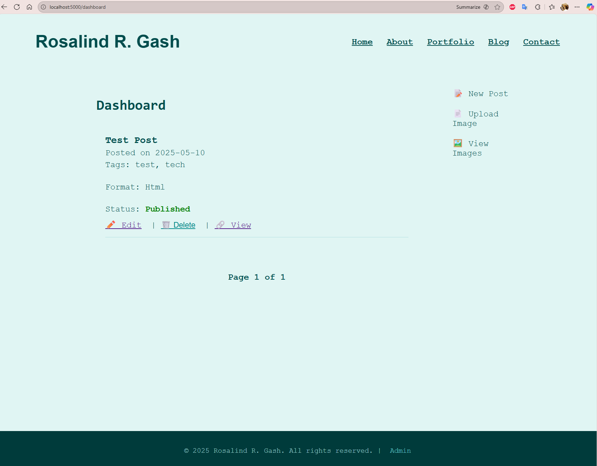

# Retro Terminal Blog (Flask)

This is a custom-built retro-style terminal blog created by **Rosalind Gash** for her personal use.
The project showcases full-stack development using **Python, Flask, SQLite, Jinja2**, and a fully hand‑crafted CMS system.


## ✨ Features
- Retro terminal aesthetic (black/green theme)
- Custom CMS with create/edit/delete posts
- Tag system with tag‑filtered views
- Archives page with year‑grouped posts
- Search functionality (posts + tags)
- Admin dashboard with login/logout
- Media upload gallery (images)
- Markdown or HTML post authoring (toggle system)
- Pagination for blog index & dashboard
- Pretty URLs for posts and tags
- Custom 404 page
- Google Analytics integrated site‑wide
- Fully responsive layout

## 📸 Screenshots

### Blog Post View
The retro terminal aesthetic with green-on-black theme creates a unique reading experience.


### Admin Dashboard
Full-featured CMS for managing posts, tags, and media with an intuitive interface.



## 🧱 Tech Stack
- **Python 3**
- **Flask**
- **SQLite**
- **Jinja2 Templates**
- **HTML / CSS / JavaScript**
- **WTForms**
- **Werkzeug Authentication**
- **Gunicorn / WSGI-ready structure**

## 🗂 Project Structure
```
blog/
├── app/
│   ├── templates/
│   ├── static/
│   ├── routes/
│   ├── models.py
│   ├── forms.py
│   └── __init__.py
├── instance/
│   └── blog.db
├── venv/ (ignored)
└── run.py
```

## ⚙️ Running Locally
1. Create and activate a virtual environment
2. Install requirements:
   ```
   pip install -r requirements.txt
   ```
3. Run the development server:
   ```
   python app.py
   ```

## 🎨 Design Notes
- Uses a hand‑styled retro terminal theme for the blog section  
- Static pages (Home, About, Portfolio, Contact) use a clean modern white‑background layout  
- Blog posts are fully HTML‑rendered (no Markdown required unless chosen)

## 📄 License
This project is maintained as part of the creator’s portfolio and is not licensed for commercial reuse.

## 📬 Contact
**Rosalind R. Gash**  
Email: rrgash@protonmail.com  
Website: https://rosalindgash.org
